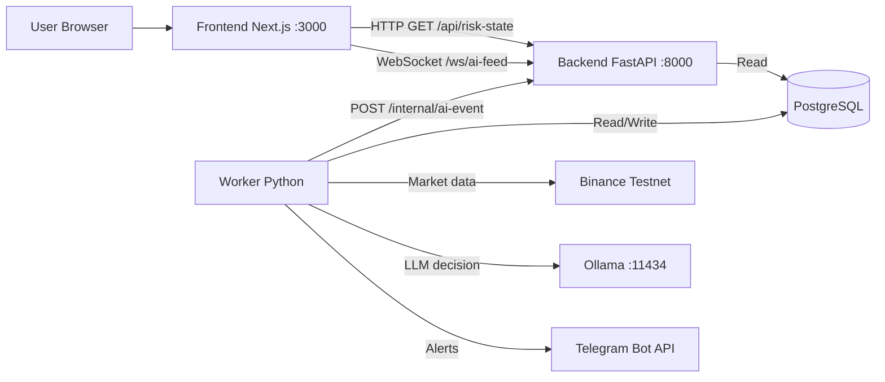
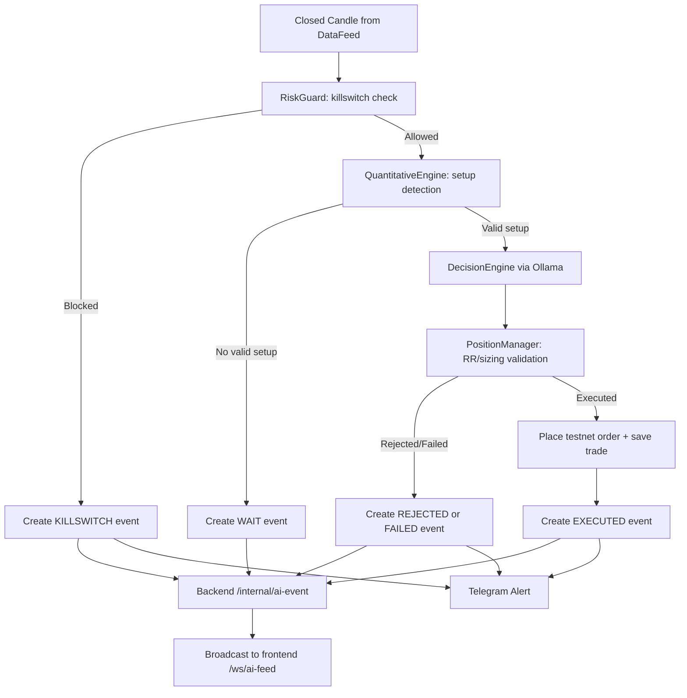
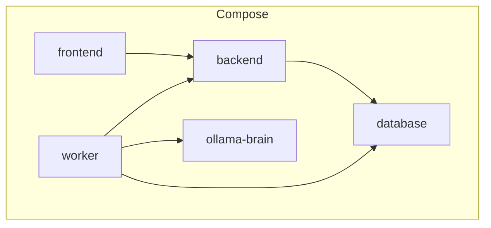

# OpenClaw Architecture

This document is a quick reference for how OpenClaw components connect and how one candle moves through the system.

## 1) Service Architecture

### Notes
1. Frontend does not call worker directly.
2. Worker publishes events to backend, and backend broadcasts to frontend via WebSocket.
3. Postgres is the state source for trades and daily risk values.

## 2) Candle-to-Decision Pipeline

## 3) Runtime Components (Docker Compose)

### Notes
1. `frontend` depends on `backend`.
2. `worker` depends on `backend`, `database`, and `ollama-brain`.
3. Health checks gate startup order.
