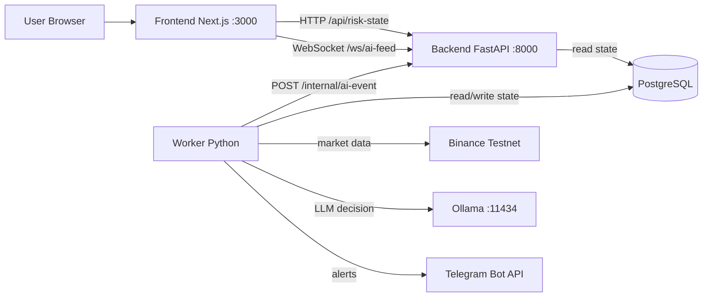
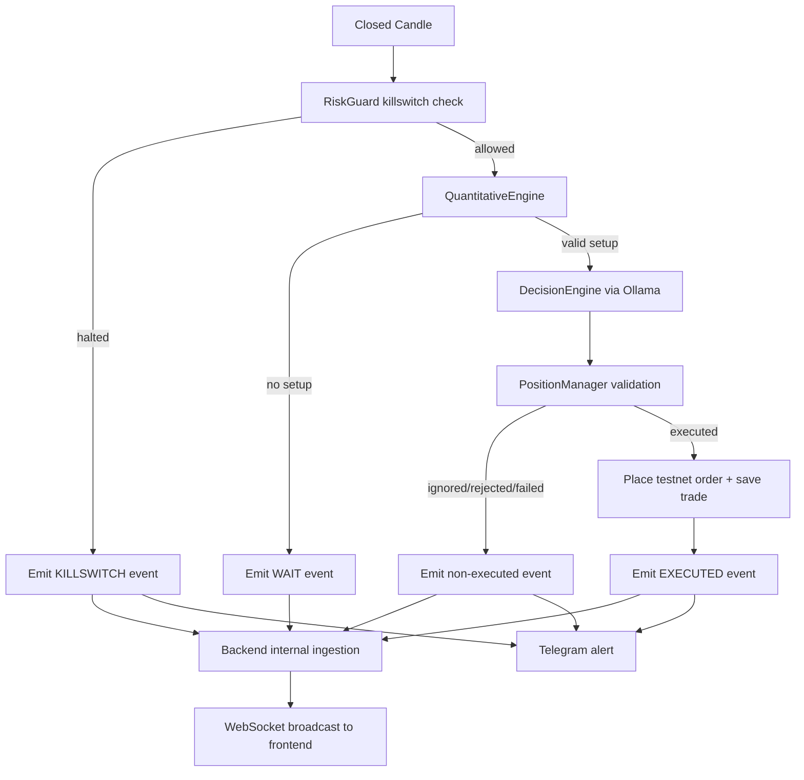

# OpenClaw Agent

OpenClaw is an AI-assisted crypto trading system that runs in Docker.

For system diagrams, see [ARCHITECTURE.md](ARCHITECTURE.md).

It has:
1. A frontend dashboard (`http://localhost:3000`) to view live signals.
2. A backend API (`http://localhost:8000`) for risk state + websocket feed.
3. A worker service that reads market candles, runs strategy checks, asks the AI model, applies risk rules, and publishes events.
4. Postgres for state and trade records.
5. Ollama for local LLM decisions.
6. Optional Telegram alerts.

## Tech Stack

### Backend
1. Python 3.10
2. FastAPI + Uvicorn
3. SQLAlchemy + psycopg2 (PostgreSQL)
4. CCXT (Binance testnet data/execution)
5. Pandas + NumPy
6. Aiohttp
7. Pytest

### Frontend
1. Next.js 14
2. React 18
3. TypeScript
4. Tailwind CSS

### Infrastructure
1. Docker + Docker Compose
2. PostgreSQL 15
3. Ollama (`deepseek-r1:7b`)

## Architecture

### Service-level diagram



### Worker pipeline diagram



## Project Structure

```text
openclaw_agent/
|- .env
|- .env.example
|- .gitignore
|- docker-compose.yml
|- START_OPENCLAW.bat
|- CHECK_OPENCLAW.bat
|- STOP_OPENCLAW.bat
|- README.md
|- backend/
|  |- Dockerfile
|  |- requirements.txt
|  |- main.py
|  |- worker.py
|  |- simulate.py
|  |- ai/
|  |  |- decision_engine.py
|  |  |- parser.py
|  |  `- prompt_builder.py
|  |- core/
|  |  |- config.py
|  |  |- database.py
|  |  |- exchange.py
|  |  `- logger.py
|  |- execution/
|  |  |- position_manager.py
|  |  `- risk_guard.py
|  |- strategy/
|  |  |- data_feed.py
|  |  |- market_structure.py
|  |  `- sessions.py
|  |- notifications/
|  |  `- telegram_bot.py
|  |- models/
|  |  `- schemas.py
|  |- knowledge_base/
|  |  `- master_desk_manual_v4.txt
|  `- tests/
|     |- conftest.py
|     |- test_api_integration.py
|     |- test_decision_engine.py
|     |- test_market_structure.py
|     |- test_position_manager.py
|     |- test_risk_guard.py
|     `- test_worker_pipeline.py
`- frontend/
   |- Dockerfile
   |- package.json
   |- package-lock.json
   |- next.config.js
   |- postcss.config.js
   |- tailwind.config.ts
   |- tsconfig.json
   |- next-env.d.ts
   `- src/
      |- app/
      |  |- globals.css
      |  |- layout.tsx
      |  `- page.tsx
      |- components/
      |  |- StatsPanel.tsx
      |  `- Terminal.tsx
      `- services/
         `- api.ts
```

## Prerequisites

1. Windows with Docker Desktop installed.
2. Docker Desktop running.
3. Binance testnet API key/secret (if you want execution path).
4. Telegram bot token + chat ID (optional alerts).

## Quick Start (One-click)

1. Double-click `START_OPENCLAW.bat`
2. Open `http://localhost:3000`
3. To check status quickly, double-click `CHECK_OPENCLAW.bat`
4. To stop everything, double-click `STOP_OPENCLAW.bat`

## Manual Start (Terminal)

```powershell
cd d:\cursor-projects\2-openclaw-style-ai-trader\openclaw_agent
docker compose up -d --build
docker compose ps
```

## Environment Setup (`.env`)

Copy from template if needed:

```powershell
Copy-Item .env.example .env
```

Minimum important settings:

```env
ENABLE_TESTNET=true
EXECUTE_ORDERS=false
TRADING_SYMBOL=BTC/USDT
TRADING_TIMEFRAME=5m

TELEGRAM_BOT_TOKEN=
TELEGRAM_CHAT_ID=
TELEGRAM_ALERTS_ENABLED=true
TELEGRAM_ALERTS_INCLUDE_WAIT=false
```

Notes:
1. Keep `ENABLE_TESTNET=true`.
2. Start with `EXECUTE_ORDERS=false` until you validate everything.
3. Set Telegram fields only if you want alerts.

## Health & Logs

Health endpoints:
1. `http://localhost:8000/health/live`
2. `http://localhost:8000/health/ready`

Useful logs:

```powershell
docker compose logs -f backend worker
```

## Telegram Alert Test

After updating `.env`, restart and run:

```powershell
docker compose up -d backend worker
docker compose exec -T worker python -c "import asyncio; from notifications.telegram_bot import send_telegram_message; print(asyncio.run(send_telegram_message('OpenClaw Telegram test')))"
```

Expected output: `True`

## Tests

Run backend test suite:

```powershell
cd backend
python -m pytest -q
```

## Safety Notes

1. Do not commit real secrets (`.env` must stay local only).
2. Rotate API keys if they were exposed.
3. Use testnet first and validate behavior before enabling real execution.
